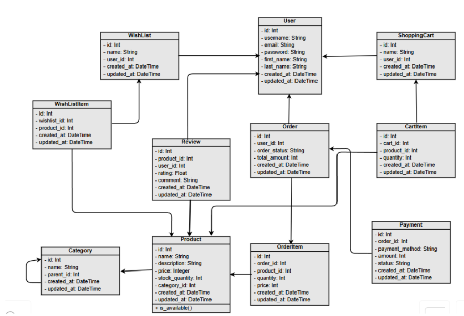
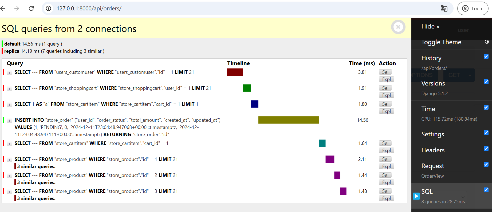
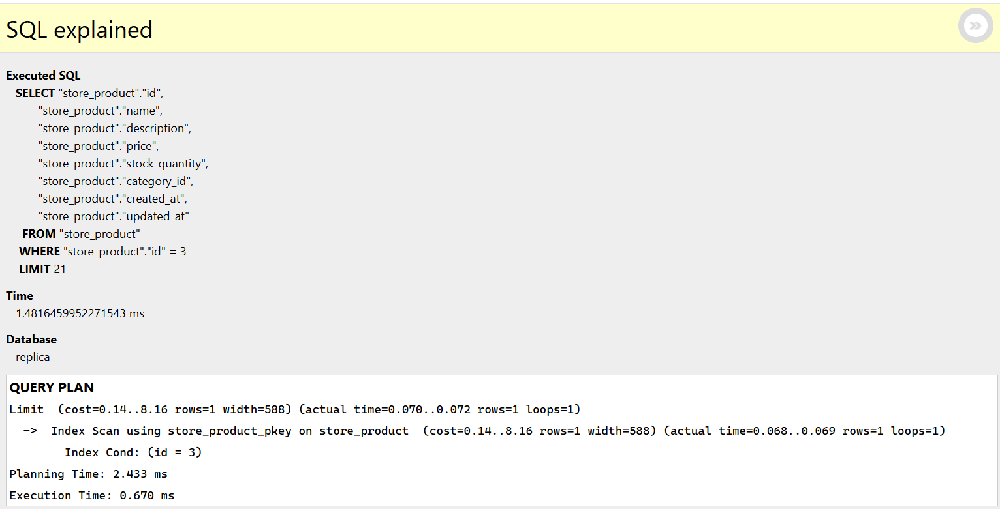
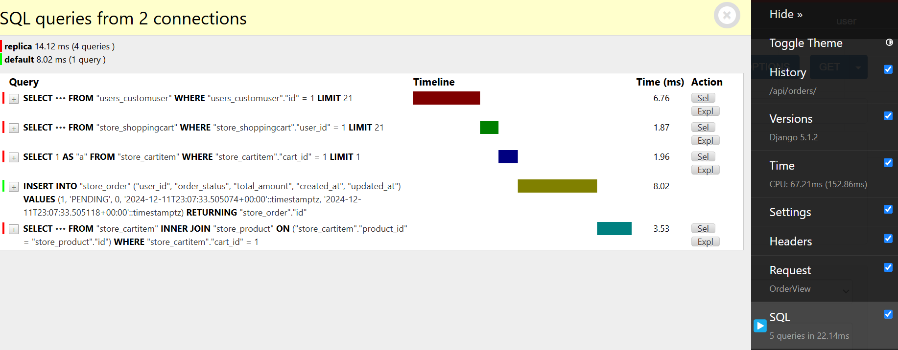
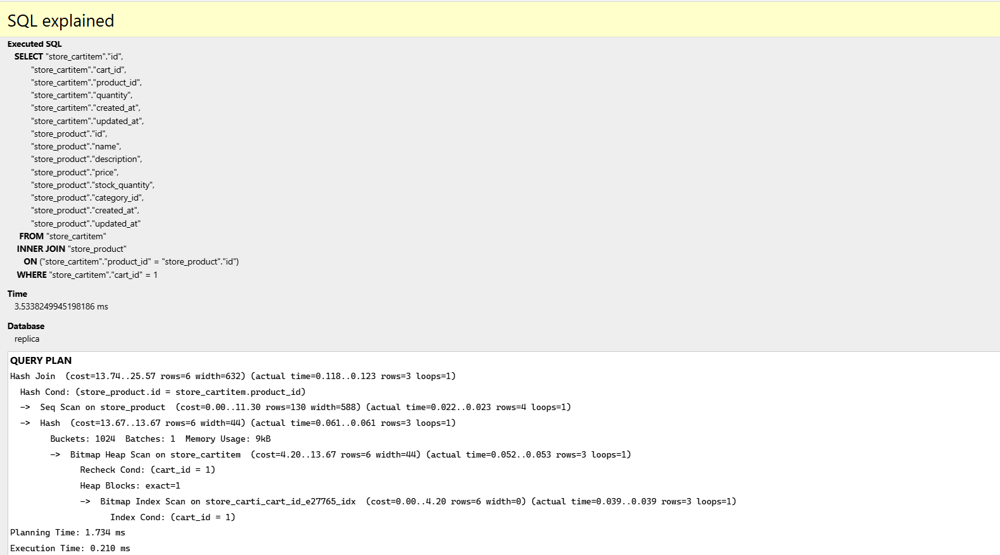

# Database Design and Optimization
Database schema for E-Commerce Web Platform where we can see the structure of database data. It was designed following 3NF principles, with tables for User (in application it is defined as CustomUser), Product, Category, ShoppingCart, WishList, Review, Order, Payment and with their associated items. 

## Normalization
This is used to normalize, organize data by breaking down large data into smaller ones. But sometimes it can lead to more complex queries.
So sometimes it is useful to use denormalized structures.

The e-commerce web application is normalized to the 3NF:
- 1NF: Each table cell contains a single value and each record is unique.
- 2NF: Non-primary key values are fully dependent on primary key.
- 3NF: Has no transitive functional dependencies.

## Indexes
They are used for fast lookup by improving performance, but it is not always needed to use them, only if necessary

`indexes = [
        models.Index(fields=['whishlist'])]` 
        , etc.

## Query Optimization
The main problem in database queries are `N + 1` problem. We need escape it. For example consider a situation where we want to add items from the shopping cart to the order, so we query using select where id is equal to user’s shopping cart id, and after iterating through items to get product details, we also need to do other separate queries to fetch its related products, leading to N+1 problem. But we can optimize it using select_related so that we do inner join between tables product and cart, fetching product details in the same query as a cart, and after iterating we don’t do separate queries to retrieve data. 

Here we can see `N + 1` problem: To retrieiive cart items with its related products, here is used usual query `cart.items.all()` and when we will try to get product details of the cart item, we need to do another query. One of these queris takes around 2 ms, and if number of products in shopping cart increases it can lead to performance problems by increasing database load.

And it is one of the queries to retrieve product details:

Here after we used query `CartItem.objects.select_related('product').filter(cart=cart)` for cart items, and it is only one query with inner join between two tables reducing number of queries.

Here is detailed query if it was represented in sql query
