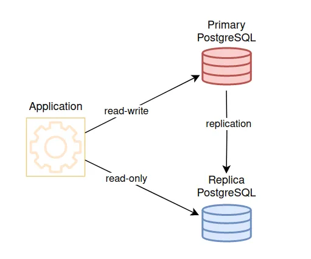

# Distributed Systems and Data Consistency

In modern e-commerce applications, distributed system and data consistency is very critical for ensuring avaiblability, scalability, and seamless user experience.
Distributed databases are designed to handle large-scale applications by spreading data across multiple nodes, providing fault tolerance, scalability, and improved performance. One of the examples are Amazon DynamoDB. It is full-managed NoSQL database with key-value relashionship. It provide low latency reads and writes. Also there one of the options Cassandra, Postgresql with replication.
- Strong Consistency - this model ensures that all replicas of the data are kept synchronized, and read of data is up-to-date.
- Eventual Consistency - if some update was made in the system, then eventually other replicas will be updated.

So, These replication databases provide strong consistency where primary database always have up-to-date replication.




Postgresql replication copies data from one server to another in real time ensuring data is always available, even during server failures. This helps with data security. It is used for tasks such as data backup, handling server-failures ensuring data availability.

Here I implemented streaming data replication, where we have one primary and one replica db. It sends Write-Ahead Log (WAL) records from primary server to replica, by keeping data consistent. Replica operates in read-only mode.

The configuration files are in `storage\`

### Primary Database configuration

<i>Defined in docker-compose.yml file settings, they will be added to the primary database configuration </i>
```
      postgres 
      -c wal_level=replica 
      -c hot_standby=on 
      -c max_wal_senders=10 
      -c max_replication_slots=10 
      -c hot_standby_feedback=on
```

<b>00_init.sql: sql script for creating replication user</b>

```
CREATE USER replica WITH REPLICATION ENCRYPTED PASSWORD 'replica-db';
SELECT pg_create_physical_replication_slot('replication_slot');
```

### Preperate Replication Database
Take backup of primary database:
```
      bash -c "
      rm -rf /var/lib/postgresql/data/*
      until pg_basebackup --pgdata=/var/lib/postgresql/data -R --slot=replication_slot --host=primary-db --port=5432 -U replica
      do
        echo 'Waiting for primary to connect...'
        sleep 1s
      done
      echo 'Backup done, starting replica...'
      chmod 0700 /var/lib/postgresql/data
      exec docker-entrypoint.sh postgres -c config_file=/config/postgresql.conf
      "
```
Use configuration file `postgresql.conf` in `config` dir to setup connection to primary database
```
primary_conninfo = 'host=primary-db port=5432 user=replica password=replica'
hot_standby = on
primary_slot_name = 'standby_replication_slot'
```

### Verify replication status
check if replica connected to primary
```
SELECT * FROM pg_stat_replication; 
```

Here I defined the functions of primary and replica database: data write operations will in primary (default) while all read operation will be in replica in not testing environment.
```
class PrimaryReplicaRouter:
    def db_for_read(self, model, **hints):
        """ Reads go to a randomly-chosen replica. """
        # return random.choice(['default', 'replica'])
        if settings.TESTING:
            return 'default'
        return 'replica'
    
    def db_for_write(self, model, **hints):
        """ Writes always go to primary. """
        return 'default'
    
    def allow_relation(self, obj1, obj2, **hints):
        """
        Relations between objects are allowed if both objects are
        in the primary/replica pool.
        """
        db_list = ('default', 'replica')
        if obj1._state.db in db_list and obj2._state.db in db_list:
            return True
        return None

    def allow_migrate(self, db, app_label, model_name=None, **hints):
        """
        All non-auth models end up in this pool.
        """
        return db == 'default'
```


---


https://medium.com/@dhruvahuja2330/mastering-consistency-models-and-data-replication-the-backbone-of-distributed-systems-778a9b2c5cec

https://medium.com/django-unleashed/securing-django-a-comprehensive-guide-to-best-practices-and-common-vulnerabilities-51a1009b6f1b

https://medium.com/django-unleashed/securing-django-a-comprehensive-guide-to-best-practices-and-common-vulnerabilities-51a1009b6f1b

https://dev.to/ifihan/testing-in-django-26e5

https://habr.com/ru/articles/709204/

