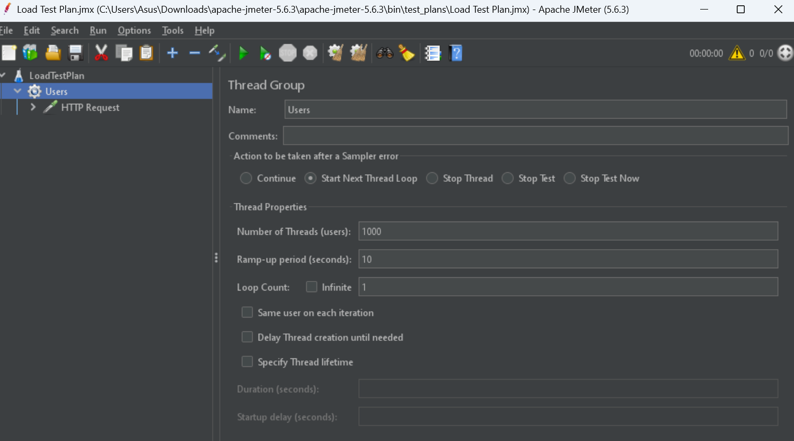
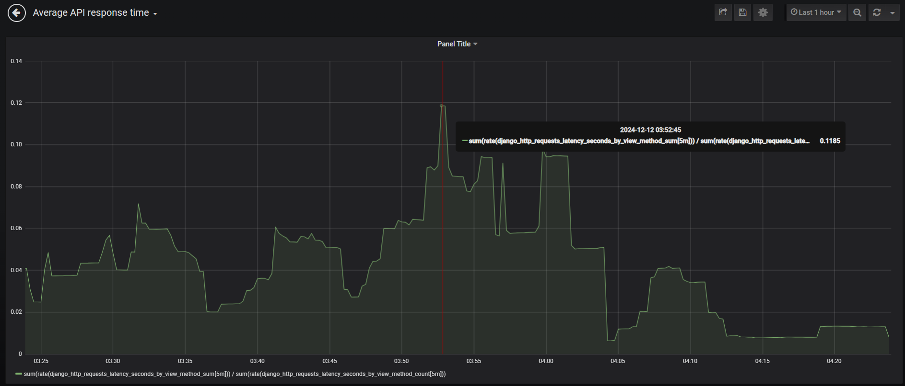
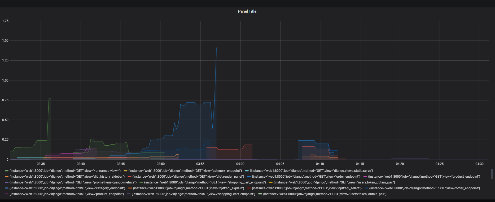
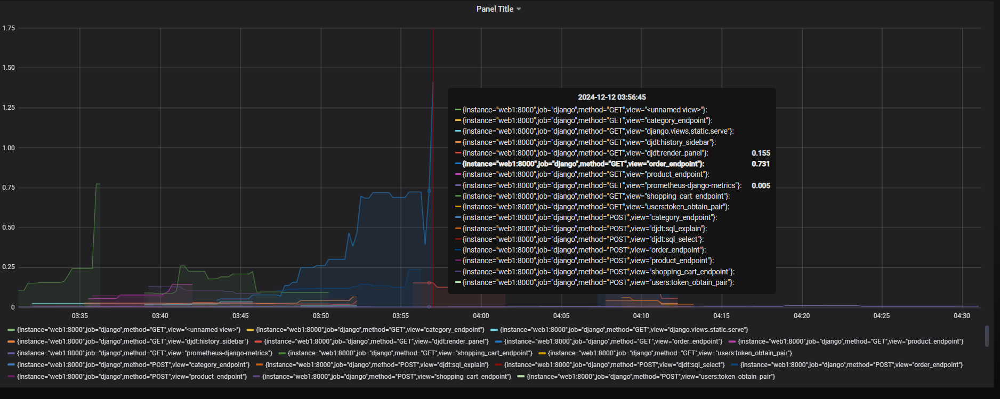
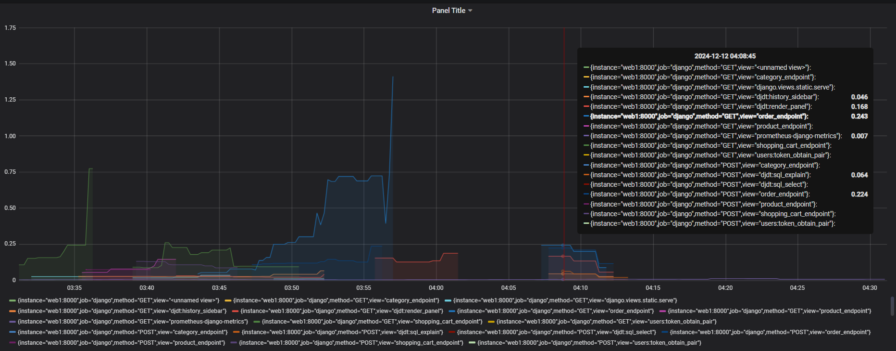
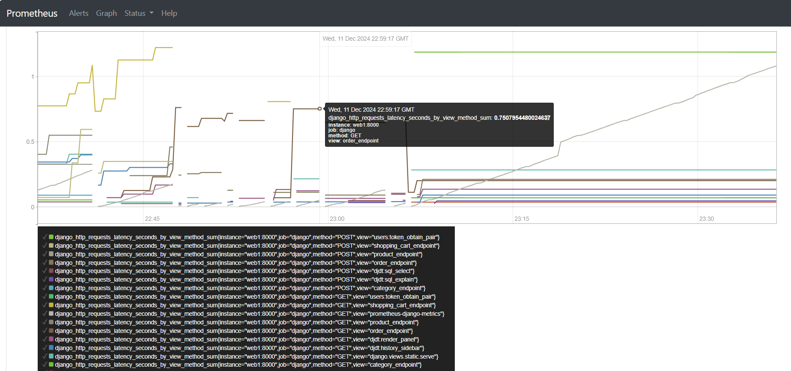

# Performance Tuning and Optimization
Performance tuning and optimization is about improving the efficiency, speed, and responsiveness of applications.


This project is aims to utilize Apache Jmeter load testing tools using test plans on these endpoints:
- GET /api/products/
- GET /api/orders/

### Creation of Test Plan


### Product Endpoint
<b>Inputs:</b> 10,000 users with remp-up period 10 seconds.

```
jmeter -n -t "test_plans/ProductTestPlan.jmx" -l "test_plans/product_logs.jtl"
```

```
Creating summariser <summary>
Created the tree successfully using test_plans/ProductTestPlan.jmx
Starting standalone test @ December 13, 2024 9:05:49 AM GMT+05:00 (1734062749215)
Waiting for possible Shutdown/StopTestNow/HeapDump/ThreadDump message on port 4445
summary +    284 in 00:00:10 =   27.6/s Avg:  5173 Min:   372 Max:  9820 Err:     0 (0.00%) Active: 1020 Started: 1303 Finished: 283
summary +    873 in 00:00:30 =   29.1/s Avg: 24499 Min:  9855 Max: 39072 Err:     0 (0.00%) Active: 147 Started: 1303 Finished: 1156
summary =   1157 in 00:00:40 =   28.7/s Avg: 19755 Min:   372 Max: 39072 Err:     0 (0.00%)
```

Summary of Results:
- total 1157 requests during the test in 40 seconds
- 28.7 requests per second
- average response time: 19755 ms
- minimum response time: 372 ms
- maximum response time: 39072 ms
- there were 0 errors

### Order Endpoint
<b>Inputs:</b> 10,000 users with remp-up period 10 seconds.

```
jmeter -n -t "test_plans/OrderTestPlan.jmx" -l "test_plans/order_logs.jtl"
```
```
Creating summariser <summary>
Created the tree successfully using test_plans/OrderTestPlan.jmx
Starting standalone test @ December 13, 2024 9:02:55 AM GMT+05:00 (1734062575224)
Waiting for possible Shutdown/StopTestNow/HeapDump/ThreadDump message on port 4445
summary +     58 in 00:00:04 =   13.5/s Avg:  2298 Min:   331 Max:  3973 Err:     0 (0.00%) Active: 1220 Started: 1277 Finished: 57
summary +    511 in 00:00:30 =   17.0/s Avg: 18753 Min:  4028 Max: 33918 Err:     0 (0.00%) Active: 709 Started: 1277 Finished: 568
summary =    569 in 00:00:34 =   16.6/s Avg: 17076 Min:   331 Max: 33918 Err:     0 (0.00%)
summary +    505 in 00:00:30 =   16.8/s Avg: 48566 Min: 33996 Max: 63074 Err:     0 (0.00%) Active: 204 Started: 1277 Finished: 1073
summary =   1074 in 00:01:04 =   16.7/s Avg: 31882 Min:   331 Max: 63074 Err:     0 (0.00%)
```

Summary of Results:
- total 1074 requests during the test in 1 min 4 seconds
- 16.7 requests per second
- average response time: 31882 ms
- minimum response time: 331 ms
- maximum response time: 63074 ms
- there were 0 errors


### Optimizations Implemented:
1. **Load Balancing**: We have implemented a load balancing mechanism using Nginx with least connection algorithm
2. **Database Query Optimization**: optimized SQL queries by adding appropriate indexes, reducing redudant queries, and optimizing data retrieval strategies.
3. **Caching**: Implemented caching to improve performance and reduce database load.

<!-- 

```
sum(rate(django_http_requests_latency_seconds_by_view_method_sum[5m])) / 
sum(rate(django_http_requests_latency_seconds_by_view_method_count[5m]))
```
rate(django_http_requests_latency_seconds_by_view_method_sum[5m]) 
/ 
rate(django_http_requests_latency_seconds_by_view_method_count[5m])




 -->