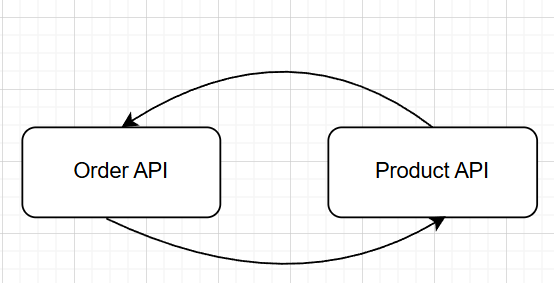
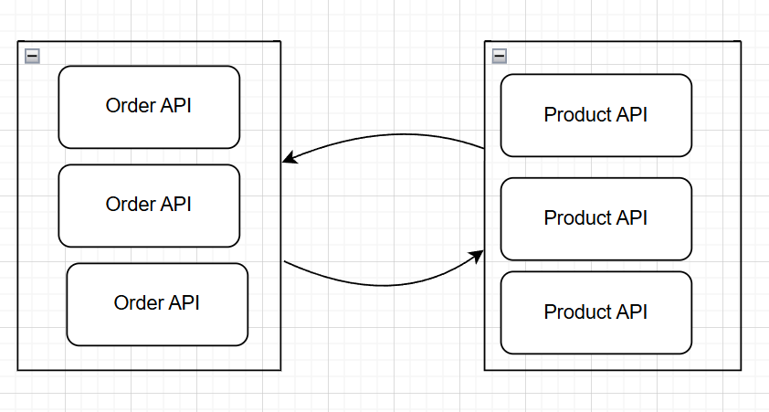

# Scaling Backend Systems
In our today's life everything is growing. So that number of people. When we create system with monolithic architecture, it won't be able to cope with growing audience. So it is necessary to use microservice architecutre nowadays.
Applications with monolithic architecutre won't be able to handle high laods and it can lead to single point of failure of one part of the system goes down.

So microservice architecutre have some benefits like: scalability, flexibility, and isolation.

Here is basic setup of microservice architecture with 3 django web servers and nginx load balancer:
```
  web1:
    <<: *web
    ports:
      - "8000:8000"
  
  web2:
    <<: *web
  
  web3:
    <<: *web

  
  nginx:
    image: nginx:latest
    volumes:
      - ./nginx/nginx.conf:/etc/nginx/nginx.conf
    ports:
      - "80:80"
    depends_on:
      - web1
      - web2
      - web3
```

To implement microservices for key features, such as product management and order processing Django uses DRF for facilating buildingi of restful apis.

Django application can be splited into seperate services like product management and order processing. Each service runs independently and communicates via API calls.



So if we add so many instances for each services, it won't affect for each other.
If one service experiences downtime, it will not affect others as long as the communication is properly handled. If for example product management experiences high traffic, we can scale just that service.

